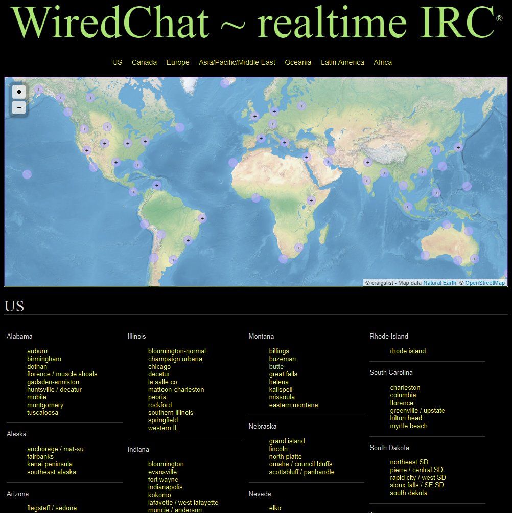
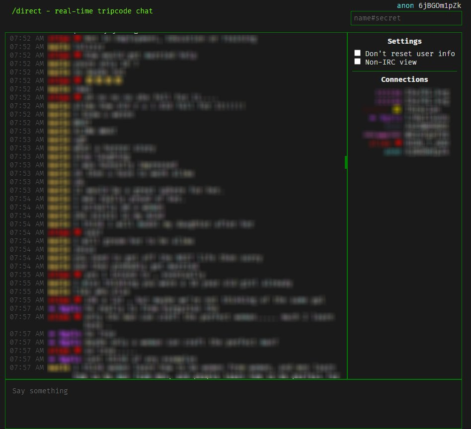
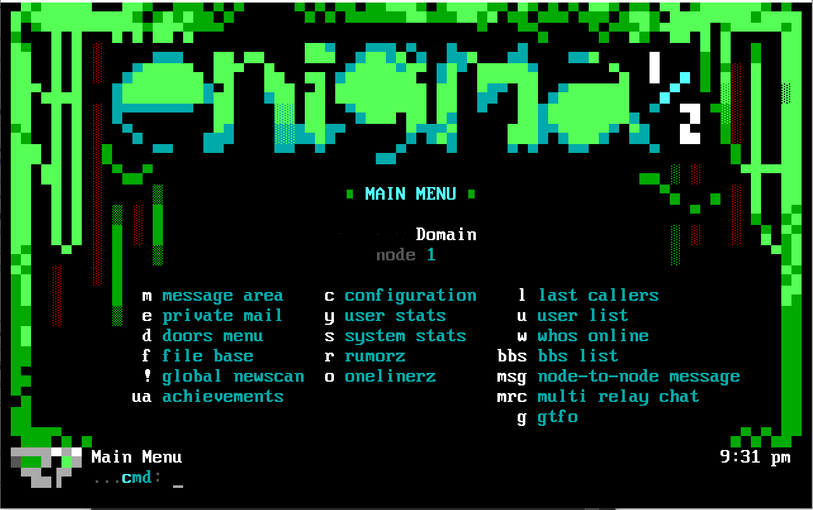
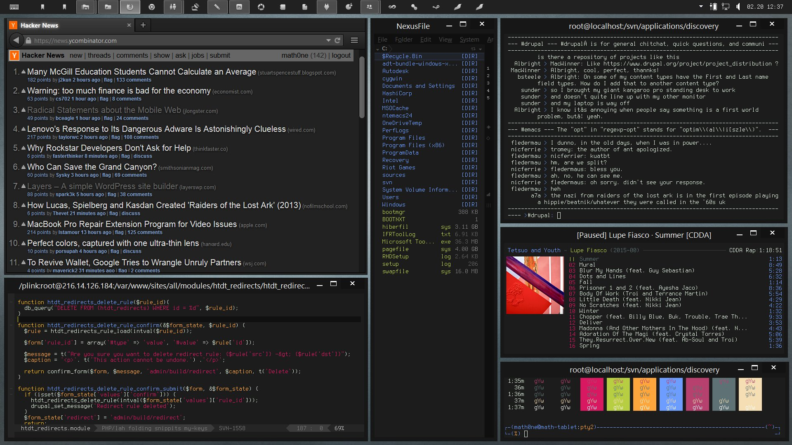

# the wired network

The wired network (working name) is a proposed system of online communication
and networking, with the aim of its participants reclaiming internet space from
social media giants, thus achieving user agency. Setting up one's own server and/or
client will be streamlined, and connecting it to a person exocortex, an independently
hosted knowledge wiki, will be strongly encouraged by the very design of the network.

The core of the network is the anonymous hyper-real-time chat, that is, a chat that
displays each message to all participants *as it is being typed*, which allows for
an entire new mode of communication; the chat becomes a brain-brain interface.

## Chat architecture

The chat network consists primarily of three components:
- Servers
  - Their task is to store and synchronize messages coming from connected clients.
  - The first "official" server to be released will be a Node.js server backed by SQLite3.
- Clients
  - Their task is to present messages received from a server and let the user send messages.
  - The first "official" client to be released will be a React application,
    embeddable in any static HTML side.
- Trackers
  - Much like TPB, a tracker is a website that tracks publicly available servers.
  - The tracker might also present various available "non-official" clients;
    someone might for instance make publicly available a command-line client for download.
  - An "official" tracker will be released and should be able to be considered a
    "source of truth" for anyone seeking to find servers, setup information etc.

Much like the IRC network, clients and servers adhere to a previously agreed upon protocol (to be decided) regarding how messages and users are handled. Client-server communication happens via SocketIO. Anyone should be able to make their own server or client and connect them to the network as long as they adhere to the protocol.

**A tracker page might look something like this, structurally:**

- Server list
  - chat.example1.com
  - chat.example2.com
- Downloads
  - Clients
    - Official client
    - ... other client implementations
  - Servers
    - Official server
    - ... other server implementations
- Setup instructions

## Background

>>>> the "illegal rave" is just a private-public party. a village festival. public gathering sans state intervention. thats all its an essential need for living. anyone can day-rent a PA system subwoofer and mixer for sub $300. put on USB mixes from soundcloud. ppl dont party anymore
>>>>
>>>> it is an essential RIGHT to once or twice a weekend be able to crash a party with dark lighting, good music, $1 grocery store canned beer and ample drugs and goes on till sunrise with many cute and well dressed young people NOT isolated to the groups they came in
>>>
>>> The online and the real are blending but i'm waiting for them to reach crossover point and reverse flows back, online used as a networking augment for irl socialization, localized city chats like USENET did. People need to start throwing raves, the irl equivalent of an irc server
>>> 
>>> we've already reached phase shift where normies are all online; zoomer normies have reached alt-normie as the new normal, everyone subscribing to microtribes; the aggressively conformist normie normie monolith of the millenial era is almost nonexistent in their generation.
>>> 
>>> wat I expect next is a divergence between online-irl communities, spheres first ordered on locality, second tribe, /soc/ style hangs that easily translate into irl meetups, little distinction between real & wired friends; and a new Xtreme online delving deep into VR hikkimorism
>>> 
>>> the commonplace rave is a natural antidote to normie tendency towards stratified, stolid cliques; its the public-private party, open but with a tribal taste filter, identical access as a standard digital server except geo-localized. e-communities NEED to regularly host raves.
>>> 
>>> the rave is perfect encapsulation of youth space; a club, bar, trap house & house party rolled into one -- the ideal uncommercialized, open-invitation, highly networked, anonymized autonomous zone. every locality DEMANDS an IRC and a weekend rave tied together.
>>
>> a network with one realtime irc chatroom (every letter shown live as its typed even before you hit send, like the realtime imageboard, its the future, trust me) for every city/county in America, every city in the world.
>
> 

>
> Each city chat is one screen w/ a realtime IRC & simple 3pg static imageboard BBS with 10 threads per pg, ordered by most recent post & deleted after reaching end of pg3. jump in anon but can set username & encrypted tripcode PW w/ clicks into simple custom profile page & dms
>
> 

> 
> Tiling screen, letting u open multiple IRCs & BBS in same screen. u are automatically dropped into your city's IRC+BBS but can freely switch out or tile into other room chats, including global rtIRCs & BBS as well custom ones created by users (autopruned if inactive)
> 
> 

> 
> full suite web/mobile browser & desktop & iphone/android apps (mobile have swiping screens, 2 tiles per screen). it will target college cities first and will grow immensely popular very quickly. image upload goes thru hosts like imgur so bandwidth costs minimal.
> 
> ALSO rtIRC as an embedded chat over personal wiki sites we all building. Embed acts as a webring, one tab listing all sites in ring, other tab a chat incl posters from any site on the ring. Click in for dedicated page w meta-ring of all other webrings & option to tile their chats

Marketed via printed cigarette lighter stickers distributed en masse, homemade wordart printouts posted across college towns by anyone; underground raves organized via semi-exclusive webrings; it comes alive on its own, distribution decentralized — this is what I envision.

An entire new collective unconscious emanating from the network, mass awakening and mass extinction, the hyper-rt-irc wired chat taking over asynchronous and slow constipated social media groups, cosmic cycles accelerating & wrapping around, wired and real blending together.

The few who cannot keep up are left to rot; oh, to reject the gift being given to them – this will be their greatest misstep; a world of true knowledge never to be uncovered and enjoyed.
